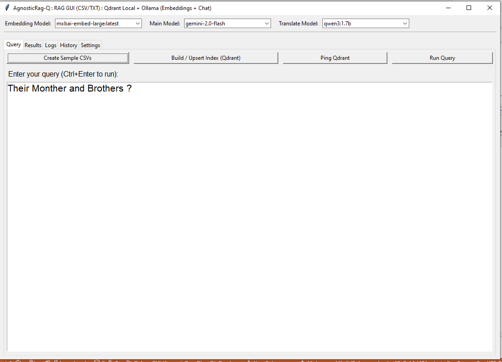
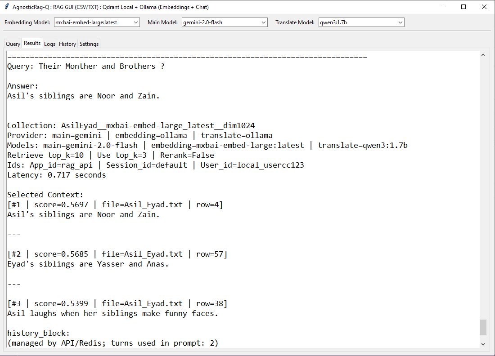
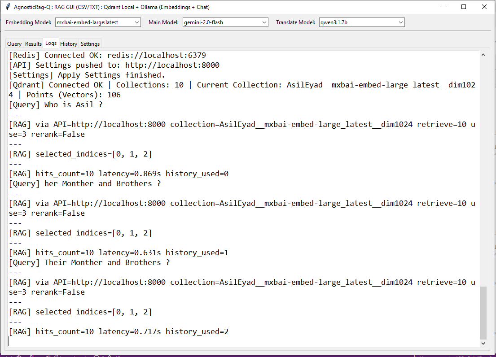
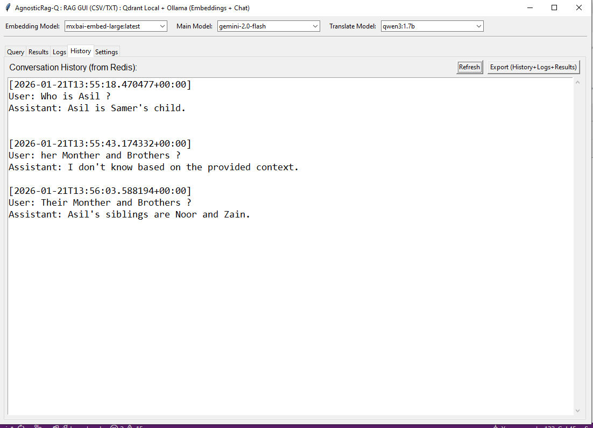
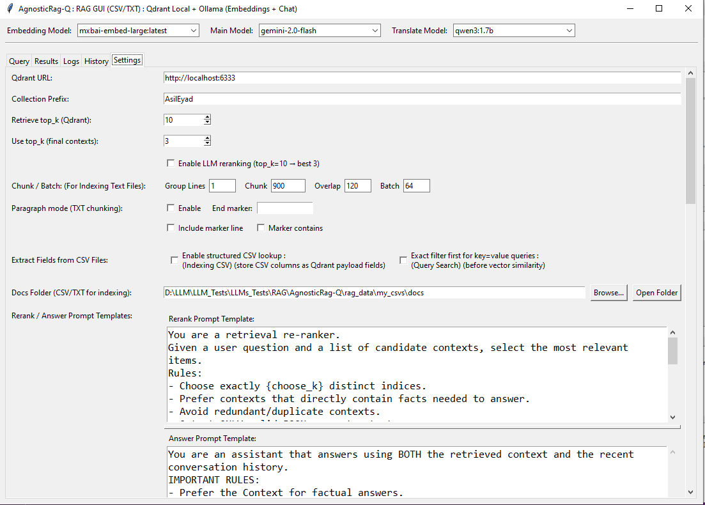
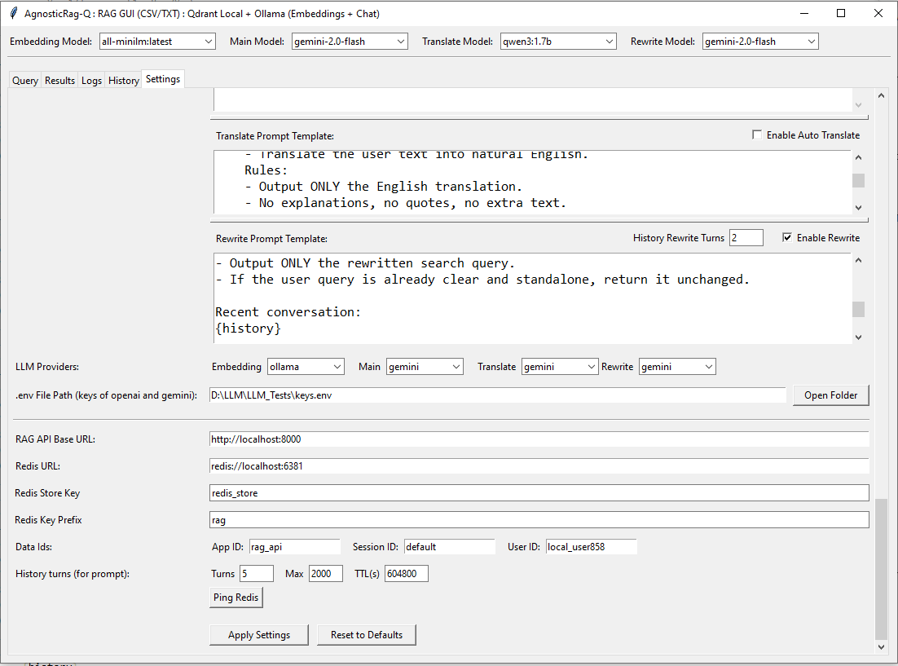

# AgnosticRag-Q

AgnosticRag-Q is a **modular, production-oriented Retrieval-Augmented Generation (RAG) platform** designed with a clean architecture. It provides a **Core RAG API** and a **GUI application** that consumes this backend, allowing you to experiment, extend, and deploy RAG pipelines with multiple LLM providers and data sources.

The project is intentionally **provider-agnostic**, making it easy to switch between LLM backends, vector stores, and data sources without rewriting business logic.

---

## ✨ Key Highlights

- **Core RAG API** built with a clean, extensible architecture
- **Simple GUI for quick testing** that uses the Core API as its backend
- **Pluggable LLM providers** (local and remote)
- **Qdrant-based vector search** with multiple data source options
- **Qdrant-Hybrid search** BM25 (sparse) + Dense embeddings
- **Designed for production** (Linux-first, Windows-friendly for development)
- **Redis Integration** Conversation history (app_id / user_id / session_id)
- **Flexible Ingestion** CSV (Fields Extracts) , TXT (Paragraph-based chunking)
- **Config-Driven** `rag_settings.json` (models, rerank, chunking, prompts)
- **Rewrite Prompt** Create standalone retrieval query,from (Final Query + short history)
```bash
User query
   ↓
Load last N Redis turns (e.g., 2–3)
   ↓
Rewrite LLM (prompt above)
   ↓
Rewritten query
   ↓
Embedding
   ↓
Qdrant
```

---

## 🧠 Architecture Overview

```
GUI (Web / Desktop)
   ↓
Core RAG API (FastAPI)
   ↓
RAG Engine
   ├── LLM Providers (Transformers, vLLM, Ollama, OpenAI, ...)
   ├── Vector Store (Qdrant)
   └── Data Sources (Files, PostgreSQL, ...)
```

- **Core API**: Handles retrieval, prompt construction, history, and inference.
- **GUI**: Thin client that communicates only with the Core API.
- **Providers**: Swappable components selected via configuration.
  
---

## 🚀 Core RAG API

The Core API is responsible for:

- Query understanding
- Context retrieval from Qdrant
- Prompt construction
- LLM inference
- Conversation history management

It can be used:
- Directly as an API (FastAPI)
- As a backend for the provided GUI
- As a base for custom applications

---

## 🖥️ GUI (Quick Testing)

The GUI is built on top of the Core API and provides:

- Interactive chat interface
- History-aware conversations
- Easy switching between RAG configurations

The GUI **does not contain RAG logic**; it strictly consumes the Core API.

---

## 🔌 LLM Providers

### Current / Supported

- **Ollama** (local)
- **OpenAI** (remote)
- **Gemini** (remote)

---

## 🔮 Incoming Features

- **Transformers provider & vLLM provider**
  - Local execution
  - Hugging Face model support
  - Transformers: Windows / Linux, GPU optional
  - vLLM: Best for Ubuntu / Linux production

- **PostgreSQL Data Source**
  - Index relational data into **Qdrant**
  - Enables RAG over structured datasets

- **Qdrant Multi-Vector Image Retrieval (Visual RAG)**
   - Index images, PDFs, and document pages using **multi-vector embeddings**
   - Patch-level retrieval via **late interaction (MaxSim)**
   - Powered by **ColPali-style vision–text encoders**
   - Enables **Visual RAG** over:
     - Scanned documents
     - Diagrams & charts
     - UI screenshots
     - Image-based knowledge bases
   - Designed to integrate with OCR pipelines for **image → text → LLM augmentation**
  
---
## 📦 Vector Store

- **Qdrant** is used as the primary vector database
- Supports:
  - Dense vector search
  - Metadata filtering
  - Multi-collection setups

---

## 🛠️ Configuration

The system is configured via:

- Environment variables
- Config files
- Provider-specific settings

This allows you to:
- Switch LLM providers
- Change chat, embedding, translate and  rewrite models
- Toggle rewrite prompt logic
- Select data sources
  
---
### Start Qdrant & Redis & RedisInsight By Docker `docker-compose.yml`

Start All
```bat
docker compose up -d
```

Stop All
```bat
docker compose down
```
---

## ▶️ How to Run

### 1. Create Virtual Environment

```bash
python -m venv .venv
source .venv/bin/activate   # Linux / Mac
.venv\Scripts\activate    # Windows
```

### 2. Install Requirements

```bash
pip install -r requirements.txt
```

> `AgnosticRag-Q/requirements.txt` contains all required packages.

---

### 3. Run / Debug with VS Code : Backend and GUI

VS Code configuration is provided:

```
AgnosticRag-Q/.vscode/launch.json
```

Use **Run** or **Debug** directly from VS Code.

---

### 4. Start the Application

- Core API runs on **http://localhost:8000**
- GUI connects to the Core API automatically

---

## 🌐 URLs

- **Swagger UI**: http://localhost:8000/docs
- **Qdrant Dashboard**: http://localhost:6333/dashboard
- **RedisInsight**: http://localhost:5540/

---

## ⚙️ Settings API

```
GET  http://localhost:8000/settings
POST http://localhost:8000/settings
```

---

## 📥 Index Data

```
POST http://localhost:8000/index/build

{
}
```

---

## 📡 Qdrant State

```
GET http://localhost:8000/ping/qdrant
GET http://localhost:8000/ping/qdrantWithInfo
```

---

## ❓ Query Stream API

```
POST http://localhost:8000/query_stream

{
  "query": "who is here Father?",
  "user_id": "local_user88777"
}
```

## ❓ Query API

```
POST http://localhost:8000/query

{
  "query": "who is here Father?",
  "user_id": "local_user88777"
}
```

---

## GUI Windows
#### Main Window



  ---
#### Results Window



---
#### Logs Window



---
#### History Window



---
#### Settings Window



---
#### Settings Window



---
#### Qdrant Collections


---
#### Redis Data


---
#### Swagger


---

## 📄 License

MIT License © 2026 Mohammed & Manaf

https://www.linkedin.com/in/mohammedkadi/

https://www.linkedin.com/in/m-manaf-mahfouz-pmi-cpmai%C2%AE-2614b48/
