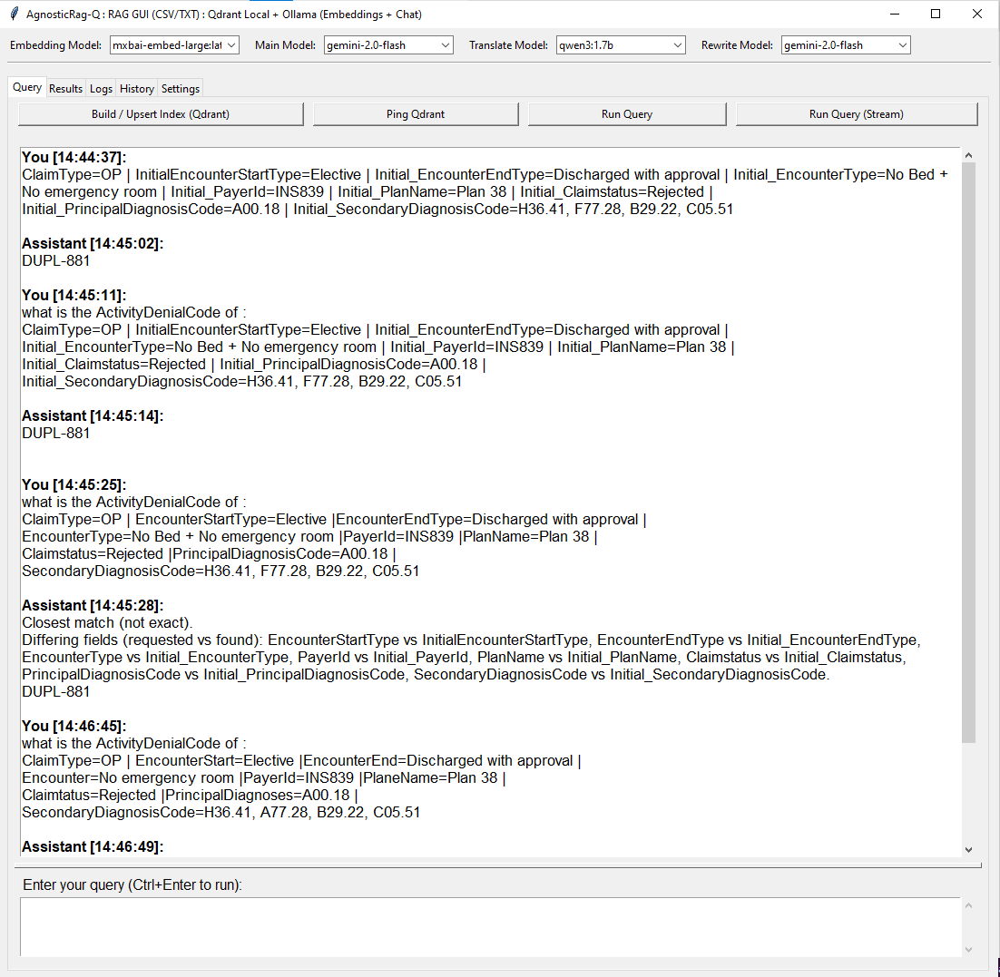

# AgnosticRag-Q

AgnosticRag-Q is a cloud agnostic and LLM agnnostic **Retrieval-Augmented Generation (RAG) platform** designed with a clean architecture. It provides a **Core RAG API** and a **GUI application** that consumes this backend, allowing you to experiment, extend, and deploy RAG pipelines with multiple LLM providers and data sources.

The project is intentionally **provider-agnostic**, making it easy to switch between LLM backends, vector stores, and data sources without rewriting business logic.

---

## ✨ Key Highlights

- **Core RAG API** built with a clean, extensible architecture
- **Config-Driven** `rag_settings.json` (models, rerank, chunking, prompts)
- **Pluggable LLM providers** (local and remote) 
- **Horisontal Scalable** (cloud / on-prem)
- **Redis based** Conversation history (app_id / user_id / session_id)  
- **Qdrant-based vector search** with multiple data source options
- **Qdrant-Hybrid search** BM25 (sparse) + Dense embeddings
- **Rewrite Prompt** Create standalone retrieval query,from (Final Query + short history)
- **Flexible Ingestion** CSV (Fields Extracts) , TXT (Paragraph-based chunking) 
- **Simple GUI for quick testing** that uses the Core API as its backend
---
- **Rewrite Prompt**
```bash
User query
   ↓
Load last N Redis turns (e.g., 2–3)
   ↓
Rewrite LLM (prompt above)
   ↓
Rewritten query
   ↓
Embedding
   ↓
Qdrant
```
---
- **Config-Driven** `rag_settings.json` (models, rerank, chunking, prompts)
```bash
{
  "api_base_url": "http://localhost:8000",
  "qdrant_url": "http://localhost:6333",
  "collection_prefix": "claims_hybridC",
  "topk_retrieve": 10,
  "topk_use": 3,
  "enable_rerank": false,
  "text_group_lines": 1,
  "txt_chunk_chars": 900,
  "txt_overlap": 120,
  "batch_size": 64,
  "is_paragraph_enable": false,
  "paragraph_end_str": "",
  "include_marker": false,
  "marker_contains": false,
  "enable_structured_csv_lookup": false,
  "enable_exact_filter_first": false,
  "enable_qdrant_hybrid_search_csv": true,
  "docs_dir": "D:\\LLM\\LLM_Tests\\LLMs_Tests\\RAG\\AgnosticRag-Q-R\\rag_data\\my_csvs\\docs",
  "rerank_prompt_template": "You are a retrieval re-ranker.\nGiven a user question and a list of candidate contexts, select the most relevant items.\nRules:\n- Choose exactly {choose_k} distinct indices.\n- Prefer contexts that directly contain facts needed to answer.\n- Avoid redundant/duplicate contexts.\n- Output ONLY valid JSON, no extra text.\n\nReturn JSON format:\n{{\n  \"selected_indices\": [0, 2, 5],\n  \"reasons\": [\"short reason 1\", \"short reason 2\", \"short reason 3\"]\n}}\n\nQuestion:\n{query}\n\nCandidates:\n{candidates}",
  "answer_prompt_template": "You are an assistant that answers strictly from retrieved context.\n\nIMPORTANT RULES:\n- Use ONLY the information in the Context.\n- First, check if there is an EXACT match to the Question (all provided key=value pairs) in a single Context row.\n- If there is an exact match:\n  - Output ONLY the value of Initial_ActivityDenialCode from that row.\n- If there is NO exact match but Context is not empty:\n  - Output:\n    Closest match (not exact).\n  - List differing fields (requested vs found).\n  - Then output ONLY the value of Initial_ActivityDenialCode from the closest-match row (the highest score row).\n- If Context is empty:\n  - Reply exactly: \"I don't know based on the provided context.\"\n- Do NOT add any other text.\n\nContext:\n{context}\n\nQuestion:\n{query}\n\nAnswer:",
  "translate_prompt_template": "You are a translation engine.\n\n    Task:\n    - Translate the user text into natural English.\n    Rules:\n    - Output ONLY the English translation.\n    - No explanations, no quotes, no extra text.\n    - Keep proper nouns, IDs, emails, URLs, and numbers unchanged.\n    - If the text is already English, output it unchanged.\n\n    User text:\n    {text}",
  "rewrite_prompt_template": "You are a query rewriting assistant for a retrieval-augmented generation (RAG) system.\n\nYour job is to rewrite the user's current message into a single, clear, standalone search query\nthat can be used to retrieve documents from a vector database.\n\nRules:\n- Use the conversation only to resolve references (e.g. \"it\", \"that\", \"the second one\").\n- Do NOT introduce new topics.\n- Do NOT answer the user.\n- Do NOT include chatty or conversational text.\n- Output ONLY the rewritten search query.\n- If the user query is already clear and standalone, return it unchanged.\n\nRecent conversation:\n{history}\n\nCurrent user question:\n{query}\n\nRewrite this into one concise standalone retrieval query.",
  "enable_auto_translate": false,
  "enable_rewrite": false,
  "embedding_model": "mxbai-embed-large:latest",
  "main_model": "gemini-2.0-flash",
  "translate_model": "qwen3:1.7b",
  "rewrite_model": "gemini-2.0-flash",
  "main_provider": "gemini",
  "embedding_provider": "ollama",
  "translate_provider": "ollama",
  "rewrite_provider": "gemini",
  "env_path": "D:\\LLM\\LLM_Tests\\keys.env",
  "redis_url": "redis://localhost:6381",
  "redis_store": "redis_store",
  "redis_prefix": "rag",
  "app_id": "rag_api",
  "session_id": "default",
  "user_id": "local_user858",
  "history_turns": 5,
  "history_rewrite_turns": 2,
  "history_max_turns": 2000,
  "history_ttl_seconds": 604800
}
```
---

## 🧠 Architecture Overview

```
GUI (Web / Desktop)
   ↓
Core RAG API (FastAPI)
   ↓
RAG Engine
   ├── LLM Providers (Transformers, vLLM, Ollama, OpenAI, ...)
   ├── Vector Store (Qdrant)
   └── Data Sources (Txt, CSV)
```

- **Core API**: Handles retrieval, prompt construction, history, and inference.
- **GUI**: Thin client that communicates only with the Core API to generate the config file ( helful for developers).
- **LLM Providers**: Swappable components selected via configuration.
  
---

## 🚀 Core RAG API

The Core API is responsible for:

- Query understanding
- Context retrieval from Qdrant
- Prompt construction
- LLM inference
- Conversation history management

It can be used:
- Directly as an API (FastAPI)
- As a backend for the provided GUI
- As a base for custom applications

---

## 🖥️ GUI (Quick Testing)

The GUI is built on top of the Core API and provides:

- Interactive chat interface
- History-aware conversations
- Easy switching between RAG configurations

The GUI **does not contain RAG logic**; it strictly consumes the Core API, this will help admin and developers to setup the deployment configuration quickly.

---

## 🔌 LLM Providers

### Current / Supported

- **Ollama** (local)
- **OpenAI** (remote)
- **Gemini** (remote)

---

## 🔮 Incoming Features

- **Qdrant Multi-Vector Image Retrieval (Visual RAG)**
   - Index images, PDFs, and document pages using **multi-vector embeddings**
   - Patch-level retrieval via **late interaction (MaxSim)**
   - Powered by **ColPali-style vision–text encoders**
   - Enables **Visual RAG** over:
     - Scanned documents
     - Diagrams & charts
     - UI screenshots
     - Image-based knowledge bases
   - Designed to integrate with OCR pipelines for **image → text → LLM augmentation**
   - Agentic RAG ( collection selection )
     
- **Transformers provider & vLLM provider**
  - Local execution
  - Hugging Face model support
  - Transformers: Windows / Linux, GPU optional
  - vLLM: Best for Ubuntu / Linux production

- **PostgreSQL Data Source**
  - Index relational data into **Qdrant**
  - Enables RAG over structured datasets


  
---
## 📦 Vector Store

- **Qdrant** is used as the primary vector database
- Supports:
  - Dense vector search
  - Metadata filtering
  - Multi-collection setups
  - Qdrant-Hybrid search : BM25 (sparse) + Dense embeddings

---

## 🛠️ Configuration

The system is configured via:

- Environment variables
- Config files
- Provider-specific settings

This allows you to:
- Switch LLM providers
- Change chat, embedding, translate and  rewrite models
- Toggle rewrite prompt logic
- Select data sources
  
---
### Start Qdrant & Redis & RedisInsight By Docker `docker-compose.yml`

Start All
```bat
docker compose up -d
```

Stop All
```bat
docker compose down
```
---

## 🌐 URLs

- **Swagger UI**: http://localhost:8000/docs
- **Qdrant Dashboard**: http://localhost:6333/dashboard
- **RedisInsight**: http://localhost:5540/

---

## ⚙️ Settings API

```
GET  http://localhost:8000/settings
POST http://localhost:8000/settings
```

---

## 📥 Index Data

```
POST http://localhost:8000/index/build

{
}
```

---

## 📡 Qdrant State

```
GET http://localhost:8000/ping/qdrant
GET http://localhost:8000/ping/qdrantWithInfo
```

---

## ❓ Query Stream API

```
POST http://localhost:8000/query_stream

{
  "query": "who is here Father?",
  "user_id": "local_user88777"
}
```

## ❓ Query API

```
POST http://localhost:8000/query

{
  "query": "who is here Father?",
  "user_id": "local_user88777"
}
```

---

## GUI Windows
#### Main Window


  ---
#### Main Window



  ---  
#### Results Window


---
#### Logs Window


---
#### History Window


---
#### Settings Window


---
#### Settings Window


---
#### Qdrant Collections


---
#### Redis Data


---
#### Swagger


---

## 📄 License

MIT License © 2026 Mohammed & Manaf

https://www.linkedin.com/in/mohammedkadi/

https://www.linkedin.com/in/m-manaf-mahfouz-pmi-cpmai%C2%AE-2614b48/
